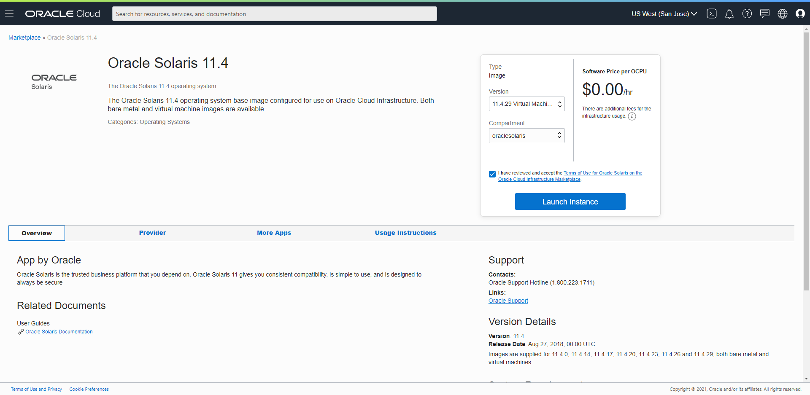
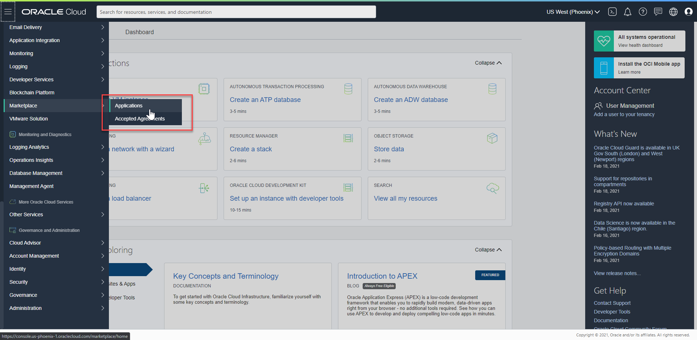
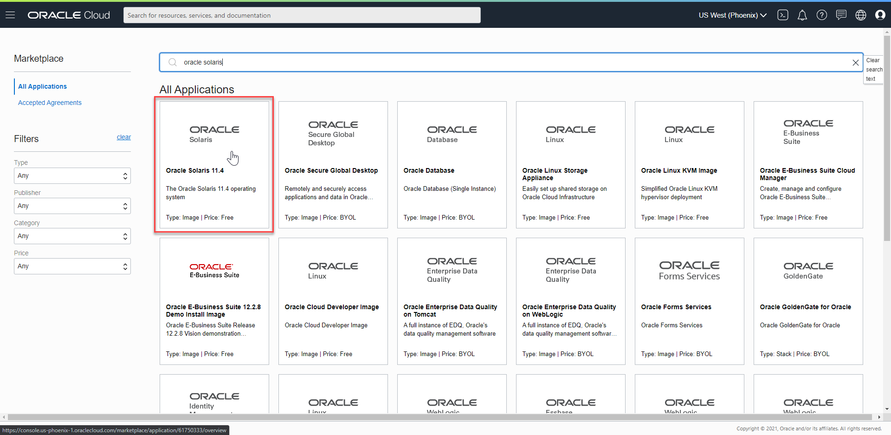
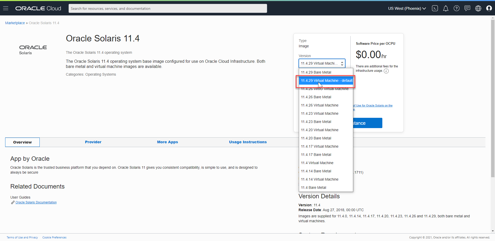
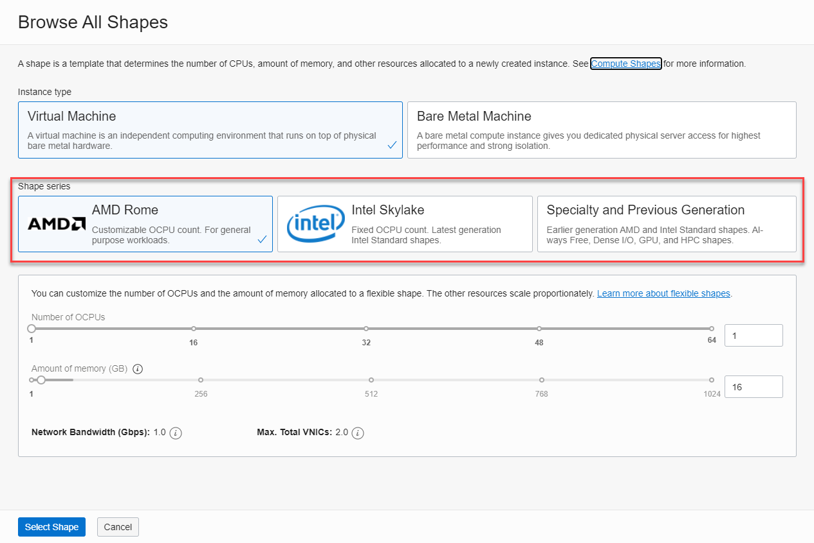
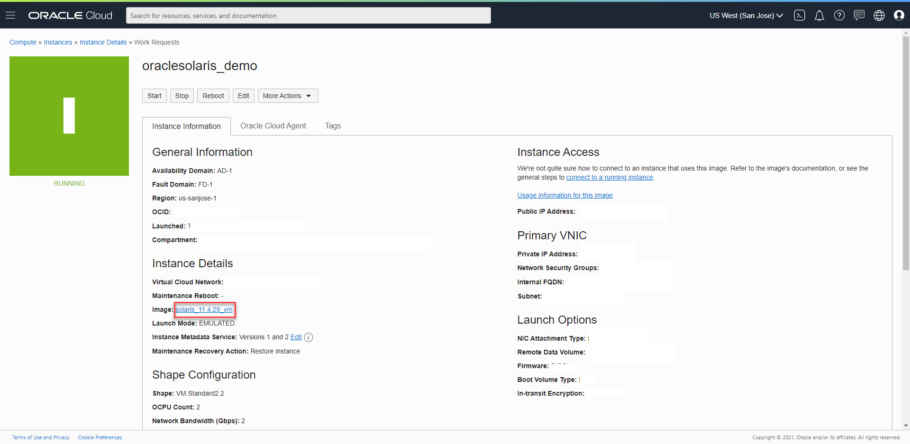

# Launching an Oracle Solaris Instance on Oracle Cloud Infrastructure

Oracle Cloud Infrastructure Compute lets you provision and manage compute hosts, known as **instances** . You can launch instances as needed to meet your compute and application requirements. After you launch an instance, you can access it securely from your computer, restart it, attach and detach volumes, and terminate it when you're done with it. Any changes made to the instance's local drives are lost when you terminate it. Any saved changes to volumes attached to the instance are retained.

Since October 2019, [Oracle Solaris 11.4](https://www.oracle.com/solaris/technologies/solaris11-overview.html) images have been available for download from the [Oracle Cloud Infrastructure(OCI)](https://www.oracle.com/cloud/) Marketplace. With Solaris now in the cloud, customers can benefit from Solaris instances running on x86 architecture. Here is walkthrough of launching an Oracle Solaris instance on OCI and the configuration options available:

## Oracle Solaris 11.4 on OCI: Installation

------

## 

Since October 2019, [Oracle Solaris 11.4](https://www.oracle.com/solaris/technologies/solaris11-overview.html) images have been available for download from the [Oracle Cloud Infrastructure(OCI)](https://www.oracle.com/cloud/) Marketplace. With Solaris now in the cloud, customers can benefit from Solaris instances running on x86 architecture. Here is walkthrough of launching an Oracle Solaris instance on OCI and the configuration options available:

## Step 1: Accessing the OCI Marketplace

After logging in to the OCI console, you can find the OCI Marketplace by clicking on the hamburger menu icon on the left. After you select Marketplace, you can then click on Applications. In the All Applications directory, you can use filters to help find the Oracle Solaris listings, as in this screenshot:

## Step 2: Launching an Oracle Solaris 11.4 instance

For Oracle Solaris 11.4, the OCI Marketplace has a dropdown menu listing the latest Oracle Solaris Virtual Machine and Bare Metal images. The Oracle Solaris 11.4.29 Virtual Machine is the latest available version(default) of Oracle Solaris in OCI, but there are options to run an older image either as a VM or a Bare Metal instance. When a new SRU update is available for Oracle Solaris on OCI, it will be added to the list as an option for your use. 

Once you choose your preferred version of the Oracle Solaris image in your compartment, you can then agree to the [terms and conditions](https://cloudmarketplace.oracle.com/marketplace/content?contentId=58993511&render=inline) and click Launch Instance. For our walkthrough, we have chosen the default 11.4.29 Virtual Machine image.

## Step 3: Configuring the instance

Once you click Launch Instance, you are directed to the Create Instance page where you choose your Availability Domain and preferred [Fault Domain](https://docs.oracle.com/en-us/iaas/Content/General/Concepts/regions.htm#fault). Another important choice you can make is to choose the underlying shape on which you wish to run the image. The default shape that OCI offers is the VM.Standard.E3.Flex with 1 core OCPU, 16 GB memory, 1 Gbps network bandwidth. But you can choose a preferred shape by selecting the Change Shape option.

For our demonstration, we are using an INTEL Skylake VM.Standard2.2 with 2 core OCPU, 30 GB memory, 2 Gbps network bandwidth. After you choose your preferred shape, you must save the Private and Public Keys(SSH Key Pairs) to your instance or you can choose to select your own pair. If using the auto-generated, SSH key pair, it is critically important to save the Private keys as it cannot be accessed later.

## Step 4: Instance Details

Once you click Create, OCI will provision and your instance will be up and running in a few seconds. Additionally, you can also find your public IP address from the Instance Information to connect to your instance using SSH. For more information on how to connect to a running instance, [click here](https://docs.oracle.com/en-us/iaas/Content/Compute/Tasks/accessinginstance.htm).

Once you are connected to your instance as an opc user, you can then choose to install additional software from the Oracle Solaris Support Repository.

Refer to the [Oracle Solaris Blog](https://blogs.oracle.com/solaris/), to learn more.

Copyright (c) 2021, Oracle and/or its affiliates. Licensed under the Universal Permissive License v 1.0 as shown at https://oss.oracle.com/licenses/upl/.