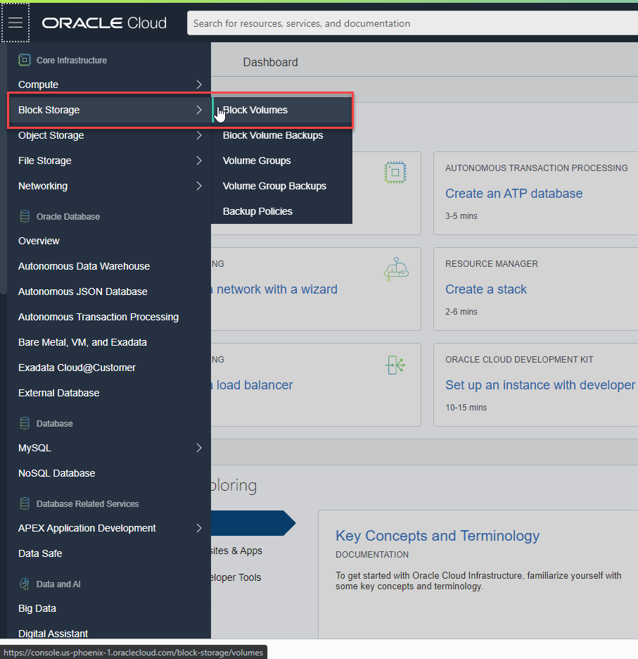
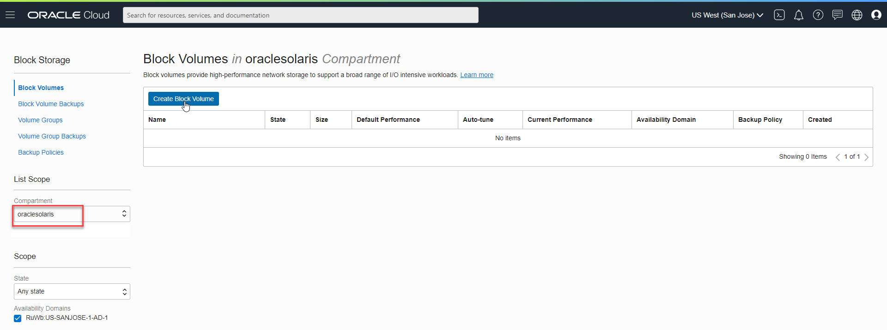
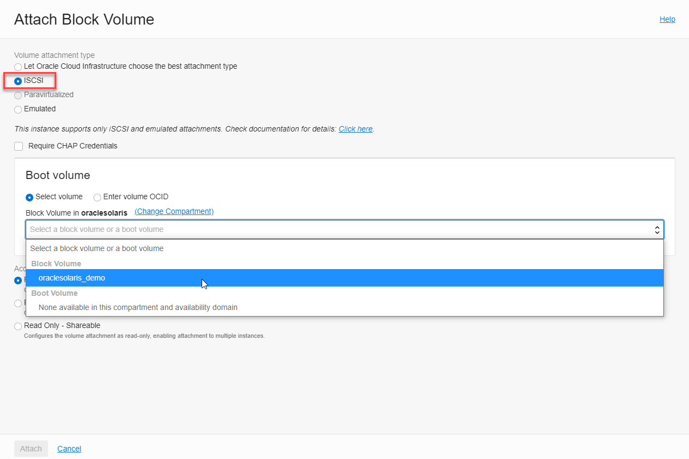

# Utilizing Storage Resources on the Oracle Cloud Infrastructure

Once you have successfully [launched an Oracle Solaris](OracleSolaris_OCI/Launch_Instance) instance, you would likely want to use other Oracle Cloud Storage resources to run your applications or deploy zones in Oracle Solaris. This document provides a demonstration on how you can create and attach Block Volumes to your Oracle Solaris instance. For more information on types of storage resources available, please refer to the [OCI documentation](https://docs.oracle.com/en-us/iaas/Content/home.htm).

------


## Step 1: Adding a block storage to your compartment 

In order to attach a block volume to your instance you need to first have a block storage created in your compartment. If you already have a block storage attached to your compartment, you can skip this step.


#### 1.1 Navigate to the Block Storage list by clicking on the hamburger icon on the left and click on Block Volumes




#### 1.2 Creating your block volume in the specified compartment





#### 1.3 Configure your block volume in your preferred compartment and define the appropriate volume size and backup policies


#### 1.4 Once you have created the Block Volume you can then navigate to your instance to attach the Block Volume to your instance


## Step 2: Attaching a Block Volume to your running instance

Once you have created a Block Volume in your compartment, you can then attach it to your running instance to start utilizing OCI storage resources.

Here is how to attach a Block Volume to your instance.

#### 2.1 Navigate to your instance and scroll down to find Resources


#### 2.2 Select Attach Block Volume and define parameters

Note: For Solaris instances, only iSCSI and emulated attachments are supported.





Once you've created a block volume and attached it to your Solaris guest in the OCI console, you still need to do a small amount of work on the Solaris guest to let it see the storage you've attached.


## Step 3: Enabling Solaris guest to recognize the attached block volume


Before we move to enable Solaris to discover the attached block volume, let us check for the available disks. Once we run the format command, we see the current available disk to be a QEMU emulated c1d0.

```
root@oraclesolaris-demo:/export/home/opc# format
Searching for disks...done

AVAILABLE DISK SELECTIONS:
       0. c1d0 <QEMU HAR-QM0000-0001-50.00GB>
          /pci@0,0/pci-ide@1,1/ide@1/cmdk@0,0
          /dev/chassis/SYS/MB/hba0
Specify disk (enter its number): 
```

In order to create a new zpool, we need to attach an iSCSI disk to the Solaris instance. 

#### 3.1 Navigate to the iSCI commands for your attached disk


#### 3.2 Run the Volume specific iSCSI commands in your console

The OCI Console will display the Linux iSCSI commands, you just need to translate them to the Solaris equivalents. Here's an example of the Linux commands:

```
sudo iscsiadm -m node -o new -T iqn.2015-12.com.oracleiaas:de785f06-2288-4f2f-8ef7-f0c2c25d6144 -p 169.254.2.2:3260
sudo iscsiadm -m node -o update -T iqn.2015-12.com.oracleiaas:de785f06-2288-4f2f-8ef7-f0c2c25d6144 -n node.startup -v automatic
sudo iscsiadm -m node -T iqn.2015-12.com.oracleiaas:de785f06-2288-4f2f-8ef7-f0c2c25d6144 -p 169.254.2.2:3260 -l
```

       0. c1d0 <QEMU HAR-QM0000-0001-50.00GB>
          /pci@0,0/pci-ide@1,1/ide@1/cmdk@0,0
          /dev/chassis/SYS/MB/hba0

Specify disk (enter its number): 

The Solaris version of the iSCSI commands follows this format:

```
sudo iscsiadm add static-config iqn.<Enter your disk specific Volume IQN>,<Enter disk specific IP Address and port>
sudo iscsiadm modify discovery --static enable
```


#### 3.3 Verify that the Solaris has discovered the attached disk


Once the disk is attached, you can now create a ZFS pool on the storage. Here is our [GitHub post](https://github.com/oracle/oraclesolaris-contrib/blob/master/Blog_Supplements/Threshold_FMA_Alerts/StatsStore_threshold_alerts.md) on how to create a ZFS pool.

Since the iscsiadm command automatically persists the configuration you enter, the storage (and the ZFS pool) will still be visible after the guest is rebooted.


Copyright (c) 2021, Oracle and/or its affiliates. Licensed under the Universal Permissive License v 1.0 as shown at https://oss.oracle.com/licenses/upl/.